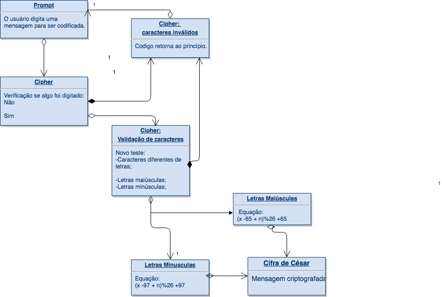

Laboratória 
Sprint 1 - Produto Final

CIFRA DE CÉSAR    
Essa página web, escrita em JavaScript, recebe um TEXTO de um prompt() e retorna para o usuário a mesma mensagem criptografada de acordo com o a Cifra de César com o parâmetro de deslocamento de 33 espaços à direita.

Antes de fazer a criptografia, o código checa se é um input válido, ou seja, se foi digitado algo e se são apenas letras. Se positivo, o programa criptografa a mensagem, se negativo, o programa pede ao usuário que digite uma mensagem válida. O último comando é repetido até que o input seja apenas letras(*A* a *Z* e *a* a *z*).
Após criptografar, a segunda função, que tem como parâmetro o resultado da primeira, já descriptografa. Como o resultado da primeira será apenas letras, não é necessário checar novamente qual caracter está no input.

Variáveis:

letter: letra original;
x: a posição do caracter no código ASCII;
n: parâmetro fixo (Para essa função n=33);

OBS: Como no código ASCII o alfabeto maiusculo começa na posição 65 e minusculo na posição 97, e não na posição 0, é necessário algumas adaptações nas fórmulas. 

Esse código tem dua funções:
1). Criptografar : function cipher
Equação geral: 
        cifra = (x + n)%26

Equação final:
        cifra = (x -65 + n)%26 +65 (para letras maiúsculas)
        cifra = (x -97 + n)%26 +97 (para letras minúsculas)

2). Descriptografar: function decipher
Equação geral: 
        decifra = (x - n)%26

Equação final:
        decifra = (x +65 - n)%26 +65 (para letras maiúsculas)      
        decifra = (x +97 - n)%26 +97 (para letras minúsculas)

Por exemplo:
- Texto original: ABCDEFGHIJKLMNOPQRSTUVWXYZ
- Texto codificado: HIJKLMNOPQRSTUVWXYZABCDEFG

